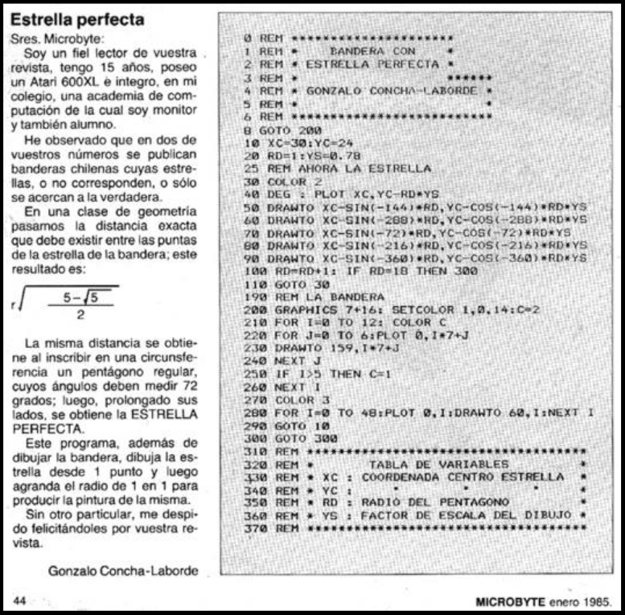

# From Atari BASIC to C# with Wisej.NET: Modernizing the Perfect Star

In the 1980s, a 15-year-old Chilean, **Gonzalo Concha-Laborde**, published in *Microbyte* magazine an Atari BASIC program that drew the Chilean flag with a mathematically perfect star, based on the geometry of regular pentagons.

That code, written for an Atari 600XL, is a clear example of how **legacy applications** are born: with passion, ingenuity, and within the technological limits of their time.

Decades later, I revisited the same logic and modernized it in **C# with WinForms/Wisej.NET**, encapsulating the star and the flag into reusable classes.  
The result is a modern graphical component, portable to the web with Wisej.NET, but faithful to the mathematical design of the original code.

This experience illustrates what we often see in organizations today:

- Applications written 20 or 30 years ago remain **critical in production**.  
- Modernization does not mean replacement, but rather **rescuing their value** and bringing them into the present with new technologies.  
- Legacy becomes **living technological capital**.

Modernization honors the ingenuity of those who wrote the original code and ensures those solutions continue to deliver value today.

---

# De Atari BASIC a C# con Wisej.NET: Modernizando la Estrella Perfecta

En los años 80, un joven chileno de 15 años, **Gonzalo Concha-Laborde**, publicó en la revista *Microbyte* un programa en Atari BASIC que dibujaba la bandera chilena con una estrella perfecta, basada en la geometría de pentágonos regulares.

Ese código, escrito para un Atari 600XL, es un ejemplo de cómo nacen muchas **aplicaciones legacy**: con pasión, ingenio y en el marco de las limitaciones tecnológicas de su época.

Décadas después retomé esa misma lógica y la modernicé en **C# con WinForms/Wisej.NET**, encapsulando la estrella y la bandera en clases reutilizables.  
El resultado es un componente gráfico moderno, portable a la web con Wisej.NET, pero fiel al diseño matemático del código original.

Esta experiencia refleja lo que ocurre en muchas organizaciones:

- Aplicaciones escritas hace 20 o 30 años siguen siendo **críticas en producción**.  
- Modernizarlas no significa reemplazarlas, sino **rescatar su valor** y traerlas al presente con nuevas tecnologías.  
- El legado se convierte en **capital tecnológico vivo**.

Modernizar es honrar el ingenio de quienes escribieron el código original y asegurar que esas soluciones sigan aportando valor hoy.

### Original article - artículo original - Microbyte
